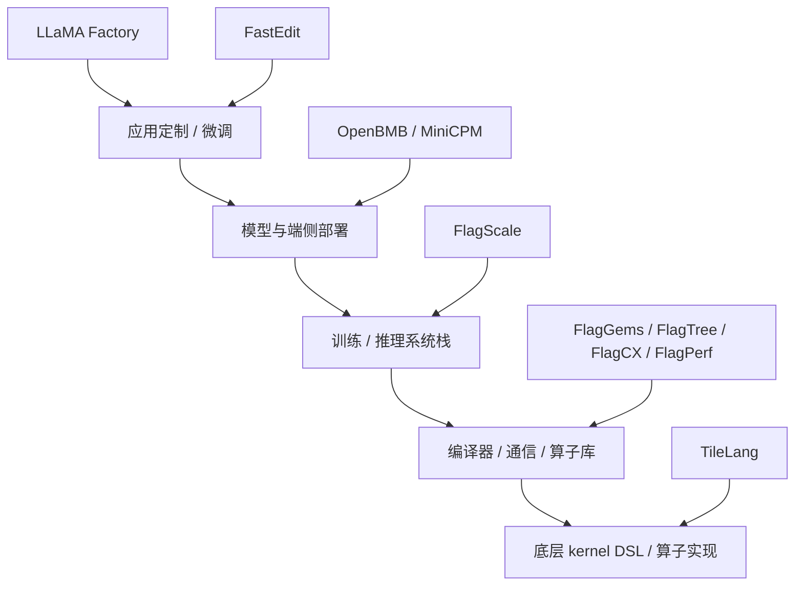

# AI 开源组件完整调研报告

调研日期：2026-07-01  
调研对象：LLaMA Factory、OpenBMB/MiniCPM、FlagOS、FastEdit、TileLang  
调研口径：优先使用官方 GitHub、官方文档、论文/技术报告、PyPI 元数据；新闻和第三方介绍仅作辅助背景，不作为核心依据。
注意：GitHub stars、forks、最近提交时间、PyPI 版本和官方 benchmark 都是时间敏感数据。本报告中的数值代表 2026-07-01 查询快照；实际立项或采购前应重新拉取一次数据并在目标硬件上复测。

## 1. 执行摘要

这五类组件不在同一技术层级。它们更像大模型工程链路中的五个不同位置：

核心结论：

| 组件 | 一句话定位 | 和“算子开发”的关系 | 当前投入优先级 |
|---|---|---:|---:|
| TileLang | 面向高性能 GPU/CPU/加速器 kernel 的 Tile 级 DSL | 直接相关，适合写 GEMM、Attention、Dequant GEMM、FlashMLA 等算子 | 高 |
| FlagOS | 面向多芯片场景的开源 AI 系统软件栈 | 直接相关，尤其是 FlagGems、FlagTree、KernelGen、FlagPerf | 高 |
| LLaMA Factory | 低门槛微调、RLHF、评估、部署工具链 | 间接相关，可作为上层模型任务和回归测试入口 | 中 |
| OpenBMB / MiniCPM | 端侧/低资源 LLM 与多模态模型族 | 间接相关，可作为端侧和多模态算子优化 workload | 中 |
| FastEdit | 轻量模型知识编辑工具，主要实现 ROME | 与算子开发弱相关，且维护停滞 | 低 |

如果当前目标是“算子开发”，建议主线不是从 LLaMA Factory 或 FastEdit 入手，而是：

1. 以 **TileLang** 建立 kernel 编写与性能调优能力。
2. 以 **FlagGems / FlagTree** 理解 Triton 多后端、国产芯片适配、PyTorch 算子替换路径。
3. 用 **FlagPerf** 或自建 benchmark 做性能与正确性评测。
4. 用 **MiniCPM / LLaMA Factory** 提供真实模型 workload，验证算子是否能进入训练、微调、推理链路。
5. FastEdit 只适合做“模型知识编辑”方向的轻量背景了解，不应作为算子开发主线。

## 2. 组件成熟度快照

GitHub 数据为 2026-07-01 在线查询结果，后续会变化。

| 项目 | 官方仓库 | Stars | Forks | 最近 push | 许可证 | 维护状态判断 |
|---|---|---:|---:|---|---|---|
| LLaMA Factory | hiyouga/LlamaFactory | 72,865 | 8,900 | 2026-06-30 | Apache-2.0 | 高活跃，高生态采用 |
| MiniCPM | OpenBMB/MiniCPM | 9,531 | 626 | 2026-06-20 | Apache-2.0 | 活跃，模型持续发布 |
| MiniCPM-V/o | OpenBMB/MiniCPM-V | 25,762 | 2,015 | 2026-06-25 | Apache-2.0 | 活跃，多模态端侧重点 |
| FastEdit | hiyouga/FastEdit | 1,367 | 104 | 2023-08-13 | Apache-2.0 | 维护停滞 |
| TileLang | tile-ai/tilelang | 6,580 | 624 | 2026-07-01 | LICENSE 为 MIT 主体，GitHub API 未识别 | 高活跃，快速演进 |
| FlagGems | flagos-ai/FlagGems | 1,040 | 432 | 2026-07-01 | Apache-2.0 | 活跃，算子库核心 |
| FlagScale | flagos-ai/FlagScale | 522 | 159 | 2026-07-01 | Apache-2.0 | 活跃，已标记 v1.0.0 稳定版 |
| FlagTree | flagos-ai/FlagTree | 290 | 89 | 2026-07-01 | MIT | 活跃，多后端编译器核心 |
| FlagCX | flagos-ai/FlagCX | 217 | 60 | 2026-07-01 | Apache-2.0 | 活跃，通信库核心 |
| FlagPerf | flagos-ai/FlagPerf | 368 | 118 | 2025-11-11 | Apache-2.0 | 相对稳定，评测平台 |
| KernelGen | flagos-ai/KernelGen | 67 | 12 | 2026-06-24 | Apache-2.0 | 新兴，AI 自动生成 kernel |

## 3. LLaMA Factory

### 3.1 定位

LLaMA Factory 是一个面向 LLM/VLM 的统一高效微调框架。论文标题是 *LlamaFactory: Unified Efficient Fine-Tuning of 100+ Language Models*，论文说明其目标是把多种高效训练方法统一到一个框架中，并通过内置 Web UI LlamaBoard 支持 100+ 模型无代码微调。官方 README 也明确写到“Easily fine-tune 100+ large language models with zero-code CLI and Web UI”。

它解决的是“如何快速定制模型”，不是“如何写底层算子”。

### 3.2 核心能力

主要能力包括：

- 模型覆盖：LLaMA、LLaVA、Mistral、Mixtral-MoE、Qwen3、Qwen3-VL、DeepSeek、Gemma、GLM、Phi 等。
- 训练任务：持续预训练、多模态 SFT、奖励模型、PPO、DPO、KTO、ORPO 等。
- 参数高效方法：全量微调、冻结微调、LoRA、QLoRA，支持 AQLM、AWQ、GPTQ、LLM.int8、HQQ、EETQ 等量化路径。
- 加速与技巧：FlashAttention-2、Unsloth、Liger Kernel、KTransformers、RoPE scaling、NEFTune、rsLoRA 等。
- 推理/部署：OpenAI-style API、Gradio UI、CLI，并可接 vLLM 或 SGLang worker。
- 监控：LlamaBoard、TensorBoard、Weights & Biases、MLflow、SwanLab。

### 3.3 成熟度和生态

它是五个对象中工程采用度最高的项目。72k+ stars、8.9k forks、PyPI 包 `llamafactory` 最新查询版本为 0.9.5，且仓库在 2026-06-30 仍有提交。官方 README 还列出 Amazon、NVIDIA、阿里云等使用案例或集成链接。

高活跃度的另一面是复杂度：模型模板、数据格式、训练后端、量化方法、推理后端之间的组合很多，配置错误和版本冲突风险也高。open issues 超过 1000 个，说明生态大但维护压力也大。

### 3.4 与算子开发的关系

LLaMA Factory 对算子开发是“上层 workload 提供者”，不是算子实现工具。

适合用它做：

- 选取真实模型和训练任务，检验自研 kernel 是否能在训练/微调链路里跑通。
- 验证 FlashAttention、Liger Kernel、KTransformers 等加速组件对上层任务的收益。
- 作为“模型端到端性能回归”的入口。

不适合用它做：

- 手写或自动生成 GPU kernel。
- 适配国产芯片底层编译器。
- 直接替换 PyTorch ATen 算子。

### 3.5 选型建议

如果项目要做“模型微调平台”或“训练工作流产品”，LLaMA Factory 是优先调研对象。如果项目要做“算子开发”，它应该排在 TileLang、FlagGems、FlagTree 之后，作为上层验证环境使用。

## 4. OpenBMB / MiniCPM

### 4.1 定位

OpenBMB/MiniCPM 是模型族和端侧部署生态，不是训练框架或算子 DSL。它可以拆成两条线：

- **MiniCPM**：面向端侧、低资源、本地部署的小参数 LLM 系列。
- **MiniCPM-V / MiniCPM-o**：面向图像、视频、语音、实时多模态交互的多模态模型系列。

官方 MiniCPM README 在 2026-05-19 发布 MiniCPM5-1B，定位是 1B 级端侧、本地部署、资源受限场景模型。MiniCPM4 技术报告则强调端侧高效 LLM，并从模型结构、训练数据、训练算法、推理系统四个方面做系统优化。

MiniCPM-V/o README 显示，MiniCPM-V 4.6 是 1.3B 参数级的端侧友好多模态模型；MiniCPM-o 4.5 是 9B 参数级的全双工全模态交互模型，关注视频、音频、文本、语音输出的实时协同。

### 4.2 核心能力

MiniCPM 文本模型线：

- 端侧、本地、资源受限部署。
- MiniCPM5-1B 支持 Think / No Think 模式。
- 支持 Hugging Face、ModelScope、GGUF、MLX 等下载形式。
- 提供 vLLM、SGLang、Transformers 等 quickstart。
- 关注 agentic tool use、代码、数学、推理、本地助手。

MiniCPM-V/o 多模态线：

- MiniCPM-V 4.6：图像、视频、文本理解，1.3B 参数，强调视觉 token 压缩和端侧部署。
- MiniCPM-o 4.5：实时全双工全模态交互，视频/音频输入与文本/语音输出互不阻塞。
- 移动端覆盖：官方 README 声称 MiniCPM-V 4.6 可部署到 iOS、Android、HarmonyOS。
- 推理生态：SGLang、vLLM、llama.cpp、Ollama 等。
- 微调生态：SWIFT、LLaMA Factory 等。

### 4.3 成熟度和生态

MiniCPM-V 仓库 25k+ stars，活跃提交到 2026-06-25；MiniCPM 仓库 9.5k+ stars，活跃提交到 2026-06-20。相对于大参数通用模型，MiniCPM 的价值在于端侧部署和效率优化，而不是追求最大参数规模。

需要注意：官方 README 中包含大量自身 benchmark 和性能声称，例如“超越某些更大模型”“接近某些闭源模型”等。报告中应把这些视作官方自测/官方叙述，实际选型仍需在目标硬件、目标任务和目标语言上重跑评测。

### 4.4 与算子开发的关系

MiniCPM 对算子开发是“真实模型样本”和“端侧推理压力源”。

适合用于：

- 小模型端侧推理 kernel 验证。
- 长上下文 sparse attention、KV cache、量化、speculative decoding 的 workload。
- 多模态视觉编码、视频理解、音频/语音管线中的算子压力测试。
- 端侧部署性能对比，例如 llama.cpp、Ollama、vLLM、SGLang 路径。

不适合用于：

- 直接作为算子开发框架。
- 替代 TileLang/Triton/CUDA 写 kernel。

### 4.5 选型建议

如果目标是“做端侧模型部署或优化”，MiniCPM 是高价值 workload。如果目标是“写 kernel”，MiniCPM 应作为 benchmark 目标，而不是开发工具本身。

## 5. FlagOS

### 5.1 定位

FlagOS 是一个面向多芯片场景的统一开源 AI 系统软件栈。官方 community README 对它的目标表述是：打破不同芯片软件栈之间的生态壁垒、降低迁移成本、促进 AI 系统软件创新。

它不是单一组件，而是组件族。调研时必须拆开：

- **FlagGems**：Triton 实现的通用高性能 AI 算子库。
- **FlagTree**：多 AI 芯片后端统一编译器，fork 自 Triton。
- **FlagScale**：大模型训练、强化学习、推理生命周期工具。
- **FlagCX**：跨芯片通信库。
- **FlagPerf**：AI 芯片评测平台。
- **KernelGen**：AI 自动生成、优化、测试 kernel 的平台。
- **FlagAttention**：Triton 实现的内存高效 attention 算子集合。

### 5.2 FlagGems

FlagGems 是 FlagOS 中与算子开发最直接相关的组件之一。官方 README 将其定义为用 Triton 实现的高性能通用算子库，目标是通过 backend-neutral kernels 加速 LLM 训练和推理。

关键点：

- 与 PyTorch ATen backend 注册，目标是让模型开发者继续使用 PyTorch API。
- 支持 eager mode，不依赖 `torch.compile`。
- 支持自动 pointwise operator codegen。
- 支持 per-function runtime kernel dispatch。
- 提供 multi-backend interface，README 声称支持超过 10 个后端。

工程意义：FlagGems 是“把自定义 kernel 接进 PyTorch/模型生态”的重要参考。

风险：open issues 很多，说明覆盖面广但仍在快速建设；不同后端的算子覆盖和性能成熟度需要逐项验证。

### 5.3 FlagTree

FlagTree 是统一编译器组件，fork 自 Triton，面向多 AI 芯片 backend。官方 README 列出了多条 branch 和 backend，包括 NVIDIA、AMD、燧原、海光、摩尔线程、达摩院、辉羲、沐曦、曦望、昇腾、寒武纪、CPU 等。

关键点：

- 目标是单仓库、多后端支持。
- 面向上游模型用户提供跨后端编译能力。
- 面向芯片厂商提供接入 Triton 生态的样例。
- 引入 TLE（Triton Language Extensions），用 Lite / Struct / Raw 的层级扩展方式增强对分布式执行、内存访问和硬件特定 primitive 的控制。

工程意义：FlagTree 是理解“为什么 Triton 在国产芯片上不好直接统一跑，以及如何做多后端编译适配”的关键项目。

风险：branch 和后端版本非常多，环境搭建复杂，且不同后端需要不同 Triton 版本和系统库版本。生产选型前必须确认目标硬件、目标 branch、wheel 支持、CI 状态和算子覆盖。

### 5.4 FlagScale

FlagScale 是 FlagOS 的上层生命周期工具，官方 README 称其覆盖大语言模型、多模态模型、具身模型的训练、强化学习和推理。2026-03 的 README 声明 v1.0.0 是首个 stable release，并把硬件特定多芯片支持迁移到插件仓库，例如 TransformerEngine-FL 和 vllm-plugin-FL。

关键点：

- 统一配置和 CLI。
- 覆盖训练、RL、推理。
- 插件映射到 Megatron-LM、TransformerEngine、veRL、vLLM。
- 支持 DeepSeek-V3、Qwen2/2.5/3、Qwen2.5-VL、LLaMA、Mixtral、RWKV、Aquila 等示例配置。

工程意义：FlagScale 更像“把底层多芯片能力接到大模型生命周期”的调度和配置层。算子开发完成后，可用它验证端到端训练/推理链路。

### 5.5 FlagCX

FlagCX 是跨芯片通信库，重点在单芯片/跨芯片 collective communication 和 PyTorch/Paddle 集成。

关键点：

- 支持 NCCL、HCCL、MUSACCL、RCCL、CNCL、MCCL、TCCL、ECCL、PCCL 等通信库。
- 提供 send/recv、broadcast、allreduce、allgather、reduce_scatter、alltoall 等通信操作。
- 支持 PyTorch distributed backend 插件。

工程意义：当算子开发进入多卡训练或推理服务，通信层会成为瓶颈。FlagCX 不是 kernel DSL，但对多芯片系统性能非常关键。

### 5.6 FlagPerf

FlagPerf 是 AI 硬件评测平台。中文 README 表述其目标是建立面向产业实践的指标体系，评测 AI 硬件在“模型 + 框架 + 编译器”软件栈组合下的实际能力。

关键点：

- 不只看耗时，也看功能正确性、资源使用、生态适配能力。
- 覆盖 CV、NLP、语音、多模态等场景。
- 支持单卡、单机、多机等评测环境。
- 2024 年已加入算子评测板块。

工程意义：对算子开发来说，FlagPerf 可作为 benchmark 方法论和部分测试样例来源。

### 5.7 KernelGen

KernelGen 是 FlagOS 中的新组件，定位为 AI-powered automatic Triton kernel development platform。README 称 2.0 版本引入 MCP、IDE/agent 集成、自动 correctness/performance validation、自动 PR 等。

工程意义：它代表“AI 自动写 kernel”的方向，但当前 stars 和生态规模还小，建议作为实验性工具观察，不宜替代人工理解和基准测试。

### 5.8 FlagOS 总体判断

FlagOS 的优势：

- 系统栈覆盖完整，从算子、编译器、通信、评测到训练推理插件。
- 多芯片适配方向非常明确，尤其适合国产芯片生态。
- 和算子开发高度相关，尤其是 FlagGems、FlagTree、FlagPerf、KernelGen。

FlagOS 的风险：

- 组件多、分支多、版本复杂，初学成本高。
- 部分组件还在快速建设，成熟度不均衡。
- 官方声称覆盖多个芯片后端，但实际可用性要按目标硬件逐项验证。
- 文档、wheel、CI、硬件权限都会影响复现实验。

选型建议：如果目标是国产 AI 芯片、多后端 Triton、统一算子生态，FlagOS 是必须重点调研的对象。如果目标只是 NVIDIA 单卡写 kernel，TileLang/Triton/ThunderKittens/CUDA 路径可能更直接。

## 6. FastEdit

### 6.1 定位

FastEdit 是一个轻量模型知识编辑工具，目标是用一条命令把 fresh/customized knowledge 注入大语言模型。官方 README 的一句话描述是 “Editing large language models within 10 seconds”。

它主要实现的是 **ROME（Rank-One Model Editing）**。ROME 原论文 *Locating and Editing Factual Associations in GPT* 的核心思想是定位中层 FFN 中和事实关联相关的计算，并通过 rank-one 更新修改特定事实。

### 6.2 核心能力

官方 README 中列出的支持模型包括：

- GPT-J 6B
- LLaMA 7B/13B
- LLaMA-2 7B/13B
- BLOOM 7.1B
- Falcon 7B
- Baichuan 7B/13B
- InternLM 7B

硬件需求示例：

- LLaMA 7B FP16：24GB 显存，约 7s/it。
- LLaMA 13B FP16：32GB 显存，约 9s/it。

数据格式是包含 `prompt`、`subject`、`target`、`queries` 的 JSON。

### 6.3 成熟度和风险

FastEdit 的最大问题是维护停滞：GitHub 最近 push 为 2023-08-13，PyPI `pyfastedit` 最新查询版本为 0.0.5。它支持的模型列表也偏 2023 年主流模型，没有覆盖 Qwen3、DeepSeek、MiniCPM、Gemma 3 等较新生态。

功能上也很窄：README 的 TODO 里还写着 MEMIT、NER 自动识别、instruction-following model 的性能退化问题。也就是说，FastEdit 更像早期 ROME 工具化实现，而不是完整模型编辑平台。

如果要研究模型编辑，当前更应该同时看 EasyEdit/EasyEdit2 等维护更活跃的框架，而不是只看 FastEdit。

### 6.4 与算子开发的关系

弱相关。

FastEdit 只会在以下情况下有价值：

- 研究“模型知识编辑”本身。
- 对比微调、RAG、知识编辑的差异。
- 在模型层做少量事实修正实验。

它不适合：

- 算子开发。
- 编译器后端适配。
- 推理性能优化。
- 端侧部署优化。

## 7. TileLang

### 7.1 定位

TileLang 是本次调研中最贴近“算子开发”的组件。官方 README 将其定义为一种简洁的领域特定语言，用于开发高性能 GPU/CPU/加速器 kernel，例如 GEMM、Dequant GEMM、FlashAttention、LinearAttention。

TileLang 论文 *TileLang: A Composable Tiled Programming Model for AI Systems* 提出：现代 AI kernel 往往具有清晰的数据流模式，例如 DRAM/SRAM 之间搬运 tile、在 tile 上执行计算，但要写出峰值性能仍然困难。TileLang 的设计是把 thread binding、layout、tensorize、pipeline 等 scheduling space 与 dataflow 解耦，让开发者主要关注 kernel 数据流。

### 7.2 技术特点

核心特点：

- Pythonic DSL。
- 底层基于 TVM 编译基础设施。
- Tile-based programming model。
- 显式管理 shared memory、fragment、pipeline、layout、swizzle 等关键概念。
- 支持 JIT 编译和 kernel source 查看。
- 可 profile latency。

典型算子例子：

- GEMM。
- Dequantization GEMM。
- FlashAttention。
- LinearAttention。
- Flash MLA Decoding。
- Native Sparse Attention。
- Convolution。

### 7.3 硬件与后端

官方 README 已测试设备包括：

- NVIDIA：H100、A100、V100、RTX 4090、RTX 3090、RTX A6000。
- AMD：MI250、MI300X。

近期 README 还显示：

- 2025-02：WebGPU Codegen。
- 2025-09：AscendC 和 AscendNPU IR 后端预览。
- 2025-10：Apple Metal Device support。
- 2025-12：CuTeDSL backend 支持，可编译到 NVIDIA CUTLASS CuTe DSL。
- 2025-12：集成 Z3 theorem prover 到 TVM Arith Analyzer。
- 2026-02：TileLang Puzzles 学习项目。

相关生态仓库：

- tile-ai/tilelang-ascend：面向华为 Ascend NPU 的 TileLang 变体。
- MooreThreads/tilelang_musa：面向摩尔线程 MUSA 平台的适配版本。
- tile-ai/tilelang-puzzles：用于学习 TileLang 的练习集。

### 7.4 成熟度和生态

TileLang 仓库在 2026-07-01 仍有提交，PyPI `tilelang` 最新查询版本为 0.1.11，要求 Python >=3.10。stars 6.5k+，forks 624，发展速度很快。

许可证需要注意：GitHub API 未识别为标准 SPDX，但仓库 LICENSE 主体是 MIT License，同时写明 2024-12-01 到 2025-03-14 期间存在与 Microsoft Corporation 的额外协作条款。正式商用前应让法务或负责人检查许可证文本。

### 7.5 与算子开发的关系

直接相关，且是五个对象中最核心的算子开发入口。

它特别适合：

- 学习现代 AI kernel 的 tile 化表达。
- 快速实现 GEMM、Attention、Dequant、MLA 等核心算子。
- 在 NVIDIA/AMD 上追求接近手写 kernel 的性能。
- 比较 Triton、CUDA、CUTLASS、TVM 路径的开发效率和性能。
- 做研究型 kernel 原型。

不适合或需谨慎的地方：

- API 和后端仍快速演进，长期稳定性要观察。
- 多后端支持不等于所有后端都达到同等成熟度。
- 要拿到高性能，仍然需要理解内存层级、warp/thread block、pipeline、tensor core、layout。
- 对国产硬件适配时，可能需要切到专门 fork 或后端仓库。

### 7.6 选型建议

如果目标是学习或启动“算子开发”，TileLang 是最值得优先投入的组件。建议路线：

1. 先跑通官方 GEMM quick start。
2. 再跑 FlashAttention / Dequant GEMM。
3. 学习 `T.Kernel`、`T.alloc_shared`、`T.alloc_fragment`、`T.Pipelined`、`T.gemm`、swizzle 等 primitive。
4. 对比同一 shape 下 PyTorch、Triton、TileLang、CUTLASS 或 FlashAttention 的延迟。
5. 如果目标硬件是 Ascend 或 MUSA，再看对应适配仓库。

## 8. 横向对比

### 8.1 技术层级

| 维度 | LLaMA Factory | OpenBMB/MiniCPM | FlagOS | FastEdit | TileLang |
|---|---|---|---|---|---|
| 层级 | 训练/微调工具链 | 模型族/端侧部署 | 系统软件栈 | 模型知识编辑 | kernel DSL |
| 主要用户 | 应用工程师、算法工程师 | 模型部署/端侧工程师 | 系统工程师、芯片厂商、平台团队 | NLP/模型编辑研究者 | 算子工程师、系统研究者 |
| 产出物 | 微调模型、推理服务 | 模型权重、端侧 demo | 算子库、编译器、通信库、评测、训练推理插件 | 修改后的模型权重 | 高性能 kernel |
| 与硬件关系 | 间接依赖 GPU/NPU | 端侧和推理硬件敏感 | 强硬件适配 | 主要依赖显存 | 强硬件适配 |
| 算子开发相关性 | 中低 | 中 | 高 | 低 | 最高 |

### 8.2 适用场景

| 场景 | 推荐组件 |
|---|---|
| 快速微调 Qwen/DeepSeek/LLaMA/Gemma 等模型 | LLaMA Factory |
| 做端侧 1B/8B 小模型部署 | MiniCPM |
| 做端侧图像/视频/语音多模态模型 | MiniCPM-V / MiniCPM-o |
| 做 PyTorch 兼容 Triton 算子库 | FlagGems |
| 做多芯片 Triton 编译器后端 | FlagTree |
| 做多卡/跨芯片通信 | FlagCX |
| 做芯片和算子 benchmark | FlagPerf |
| 自动生成和优化 Triton kernel | KernelGen |
| 手写高性能 tile-level kernel | TileLang |
| 做少量事实知识编辑 | FastEdit，但建议同时评估 EasyEdit |

### 8.3 风险对比

| 组件 | 主要风险 |
|---|---|
| LLaMA Factory | 配置复杂；新模型适配速度快但稳定性需验证；open issues 多；不是底层优化工具 |
| MiniCPM | 官方 benchmark 需复测；端侧部署依赖具体硬件；模型能力和闭源模型对比需谨慎 |
| FlagOS | 组件分散；分支/后端/环境复杂；不同硬件成熟度不均；学习曲线陡 |
| FastEdit | 维护停滞；只实现 ROME；模型列表老；知识编辑可靠性和副作用需严格评估 |
| TileLang | API 快速演进；多后端成熟度不均；高性能仍需底层硬件知识；许可证文本需核查 |

## 9. 面向算子开发的建议路线

### 9.1 最小可行学习路线

第一阶段：TileLang 基础。

- 跑通 `pip install tilelang`。
- 复现官方 GEMM 示例。
- 理解 tile、shared memory、fragment、pipeline、swizzle。
- 输出 kernel source，理解生成代码。

第二阶段：性能对比。

- 选择固定 shape，例如 M=N=K=4096 的 FP16 GEMM。
- 对比 PyTorch eager、torch.compile、Triton、TileLang、CUTLASS。
- 记录 latency、TFLOP/s、正确性误差、编译时间。

第三阶段：Attention / Dequant。

- 跑 TileLang FlashAttention 和 Dequant GEMM 示例。
- 对比 FlashAttention 官方 CUDA/Triton 实现。
- 观察不同 sequence length、head dim、batch size 下的瓶颈。

第四阶段：接入上层模型。

- 选择 MiniCPM 或 Qwen 小模型作为 workload。
- 用 LLaMA Factory 或 vLLM/SGLang 构造端到端任务。
- 替换或插入自定义算子，观察端到端收益。

第五阶段：多后端/国产芯片。

- 若目标是国产芯片，调研 FlagTree 对应 backend。
- 用 FlagGems 看 PyTorch 算子替换路径。
- 用 FlagPerf 或自建 benchmark 形成可复现指标。

### 9.2 推荐投入顺序

1. **TileLang**：主线学习和实现。
2. **FlagGems**：学习 PyTorch 兼容算子库组织方式。
3. **FlagTree**：理解 Triton 多后端适配。
4. **FlagPerf**：建立评测规范。
5. **MiniCPM**：选一个真实模型 workload。
6. **LLaMA Factory**：上层训练/微调验证。
7. **FastEdit**：仅保留为模型编辑背景项。

## 10. 资料来源

核心来源：

- LLaMA Factory GitHub：https://github.com/hiyouga/LlamaFactory
- LLaMA Factory 论文：https://arxiv.org/abs/2403.13372
- LLaMA Factory 文档：https://llamafactory.readthedocs.io
- MiniCPM GitHub：https://github.com/OpenBMB/MiniCPM
- MiniCPM-V GitHub：https://github.com/OpenBMB/MiniCPM-V
- MiniCPM4 技术报告：https://arxiv.org/abs/2506.07900
- MiniCPM-o 4.5 技术报告页：https://huggingface.co/papers/2604.27393
- FlagOS GitHub 组织：https://github.com/flagos-ai
- FlagOS community：https://github.com/flagos-ai/community
- FlagGems：https://github.com/flagos-ai/FlagGems
- FlagTree：https://github.com/flagos-ai/FlagTree
- FlagScale：https://github.com/flagos-ai/FlagScale
- FlagCX：https://github.com/flagos-ai/FlagCX
- FlagPerf：https://github.com/flagos-ai/FlagPerf
- KernelGen：https://github.com/flagos-ai/KernelGen
- FlagAttention：https://github.com/flagos-ai/FlagAttention
- FastEdit：https://github.com/hiyouga/FastEdit
- ROME 论文：https://arxiv.org/abs/2202.05262
- EasyEdit 参考：https://github.com/zjunlp/EasyEdit
- TileLang GitHub：https://github.com/tile-ai/tilelang
- TileLang 文档：https://tilelang.com/
- TileLang 论文：https://arxiv.org/abs/2504.17577
- TileLang Ascend：https://github.com/tile-ai/tilelang-ascend
- TileLang MUSA：https://github.com/MooreThreads/tilelang_musa
- TileLang Puzzles：https://github.com/tile-ai/tilelang-puzzles

## 11. 最终判断

这五个组件应该按“技术链路”而不是“谁更好”理解：

- 要做模型微调：看 LLaMA Factory。
- 要找端侧/低资源模型：看 MiniCPM。
- 要做多芯片系统软件栈：看 FlagOS。
- 要做知识编辑：FastEdit 可了解，但不要重押。
- 要做算子开发：TileLang + FlagGems/FlagTree/FlagPerf 是主线。

当前目录名是“算子开发”，因此最可执行的结论是：**优先围绕 TileLang 建立 kernel 开发能力，同时用 FlagOS 体系理解多后端、PyTorch 接入和评测；LLaMA Factory/MiniCPM 只作为上层真实 workload，FastEdit 暂不进入主线。**
