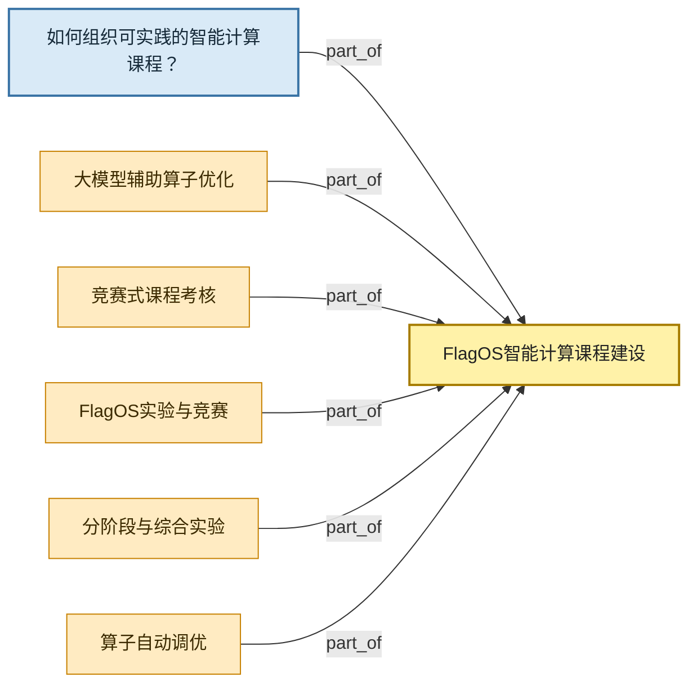
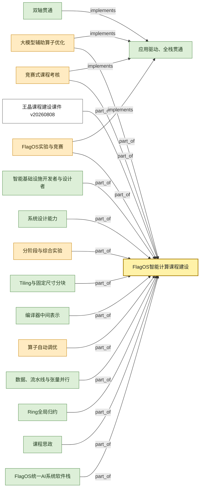
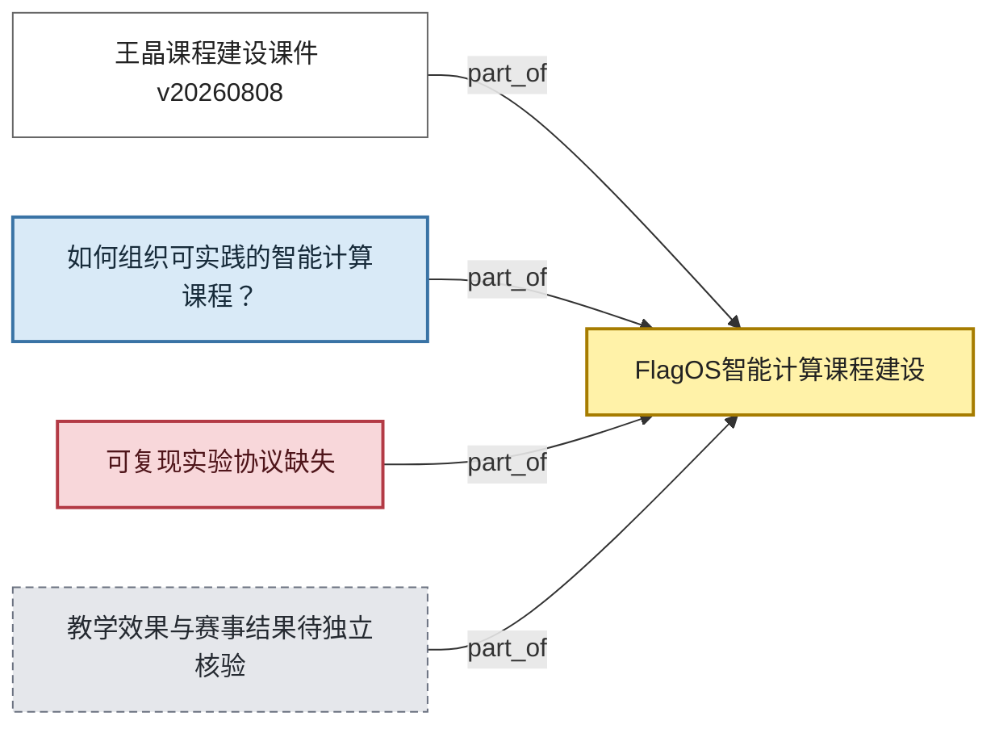

# 学习总图 — 智能计算课程建设与 FlagOS 教学融合

- 中心目标：从新增课件中提取可用于课程设计的目标、模块、实践方式、证据和边界，支持教师把算子开发、AI 编译、分布式训练与 FlagOS 实验组织成可授课路径。
- Manifest revision: `1`
- Index revision: `idx-8a7986963cf4b979-2`
- Graph version: `v0.45.0`
- 图例：黄色=中心目标；蓝色=关键问题；绿色=前置概念；白色=工作/实现；橙色=流程；红色=限制；灰色=未知。
- 实线为主线关系；局部图中的虚线为已登记但未进入默认主视图的关系。图是导航，事实以 claim、measurement 与原文证据册为准。

## 总图

```mermaid
flowchart TB
    n1["FlagOS智能计算课程建设 · 从新增课件中提取可用于课程设计的目标、模块、实践方式、证据和边界，支持教师把算子开发、AI 编译、分布式训练与 FlagOS…"]:::topic
    n2["大模型辅助算子优化"]:::pipeline
    n3["竞赛式课程考核"]:::pipeline
    n4["FlagOS实验与竞赛"]:::pipeline
    n5["可复现实验协议缺失"]:::limitation
    n6["教学效果与赛事结果待独立核验"]:::unknown
    n7["如何组织可实践的智能计算课程？"]:::question
    n8["王晶课程建设课件 v20260808"]:::work
    n9["应用驱动、全栈贯通"]:::concept
    n10["双轴贯通"]:::concept
    n11["智能基础设施开发者与设计者"]:::concept
    n12["系统设计能力"]:::concept
    n13["分阶段与综合实验"]:::pipeline
    n14["Tiling与固定尺寸分块"]:::concept
    n15["编译器中间表示"]:::concept
    n16["算子自动调优"]:::pipeline
    n17["数据、流水线与张量并行"]:::concept
    n18["Ring全局归约"]:::concept
    n19["课程思政"]:::concept
    n20["FlagOS统一AI系统软件栈"]:::concept
    n8 -->|part_of| n1
    n7 -->|part_of| n1
    n9 -->|answers| n7
    n10 -->|implements| n9
    n2 -->|implements| n9
    n3 -->|implements| n9
    n4 -->|implements| n9
    n2 -->|limited_by| n5
    n3 -->|limited_by| n6
    n11 -->|answers| n7
    n2 -->|part_of| n1
    n3 -->|part_of| n1
    n4 -->|part_of| n1
    n5 -->|part_of| n1
    n6 -->|part_of| n1
    n11 -->|part_of| n1
    n12 -->|part_of| n1
    n13 -->|part_of| n1
    n14 -->|part_of| n1
    n15 -->|part_of| n1
    n16 -->|part_of| n1
    n17 -->|part_of| n1
    n18 -->|part_of| n1
    n19 -->|part_of| n1
    n20 -->|part_of| n1
    classDef topic fill:#FFF2A8,stroke:#A67C00,color:#222,stroke-width:2px
    classDef question fill:#D9EAF7,stroke:#3973A5,color:#172B3A,stroke-width:2px
    classDef concept fill:#DDEFD8,stroke:#4F8A48,color:#1F3A1D
    classDef work fill:#FFFFFF,stroke:#666,color:#222
    classDef pipeline fill:#FFEBC2,stroke:#C78100,color:#3B2A00
    classDef interface fill:#E3F3EA,stroke:#3E8461,color:#173B2A
    classDef measurement fill:#EDE0F7,stroke:#7A4E9D,color:#321D45
    classDef limitation fill:#F8D7DA,stroke:#B33A45,color:#4F151A,stroke-width:2px
    classDef decision fill:#D7F4F0,stroke:#21867A,color:#123C37
    classDef unknown fill:#E5E7EB,stroke:#6B7280,color:#252A31,stroke-dasharray:5 3
```

## 局部图 1：中心数据流

## 局部图 2：前置概念与具体工作

## 局部图 3：限制、版本与未知

## 下钻入口

- 主线结论与当前问题：[`mainline.md`](mainline.md)
- 全量数字与协议：[`measurements.md`](measurements.md)
- 逐字原文与定位：[`evidence-notebook.md`](evidence-notebook.md)
- 可编辑问题队列：[`questions.md`](questions.md)
