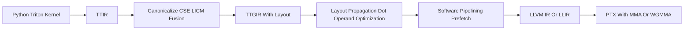

# Triton Optimization Pass Lab

本 lab 用两个 Triton kernel 观察 Triton 3.x 的编译优化流程：

- 主线 kernel：blocked GEMM，负责牵引 TTIR、TTGIR、data layout、software pipelining、tensor core lowering。
- 对照 kernel：row-wise fused softmax，负责观察 TTIR 层的融合表达、mask、reduce 和 elementwise 优化。

实验目标不是写最快的 GEMM，而是让学生能把一段 Triton Python 代码和编译器中间表示对应起来，理解哪些优化发生在 TTIR，哪些发生在 TTGIR，哪些已经是 NVIDIA 后端和 LLVM/PTX 相关的优化。

## 1. 环境准备

这个目录现在是 NVIDIA GPU / Triton 主线 lab。`../test_typst` 保留 Ascend NPU / torchair 版本的 torch.compile 五层 IR 材料,适合作后端对照,但不要把 torchair/GE 路径和这里的 Triton 路径混在一个实验里讲。

本机已验证配置:

```text
GPU: NVIDIA H200 NVL, compute capability sm_90
Python env: conda env aicompiler
PyTorch: 2.11.0+cu130
Triton: 3.6.0
```

如果 `aicompiler` 还是空环境,可以这样补齐:

```bash
conda install -p /data/zousunan/anaconda3/envs/aicompiler -y python=3.12 pip
/data/zousunan/anaconda3/envs/aicompiler/bin/python -m pip install torch==2.11.0 triton==3.6.0 numpy
```

通用检查:

```bash
/data/zousunan/anaconda3/envs/aicompiler/bin/python -c "import torch, triton; print(torch.__version__, torch.version.cuda, torch.cuda.is_available()); print(torch.cuda.get_device_name(0)); print(triton.__version__)"
```

预期输出中:

- `torch.version.cuda` 不是 `None`
- `torch.cuda.is_available()` 是 `True`
- 能打印出 NVIDIA GPU 名称,在 H200 上 compute capability 是 `sm_90`
- Triton 版本是 3.x

共享机器上先看空闲卡:

```bash
nvidia-smi
```

本 lab 的 `run_lab.py` 支持 `--device-index`。例如 GPU0 被占用时,用 GPU1:

```bash
/data/zousunan/anaconda3/envs/aicompiler/bin/python run_lab.py --kernel all --device-index 1
```

## 2. 运行实验

运行全部例子：

```bash
/data/zousunan/anaconda3/envs/aicompiler/bin/python run_lab.py --kernel all --device-index 1
```

分别运行：

```bash
/data/zousunan/anaconda3/envs/aicompiler/bin/python run_lab.py --kernel matmul --device-index 1
/data/zousunan/anaconda3/envs/aicompiler/bin/python run_lab.py --kernel softmax --device-index 1
```

可选 benchmark：

```bash
/data/zousunan/anaconda3/envs/aicompiler/bin/python run_lab.py --kernel matmul --device-index 1 --benchmark
```

默认输出目录：

```text
artifacts/
  matmul/
    00_ttir.mlir
    01_ttgir.mlir
    02_llir.ll
    03_ptx.ptx
    run.json
  softmax/
    00_ttir.mlir
    01_ttgir.mlir
    02_llir.ll
    03_ptx.ptx
    run.json
```

脚本会把 `TRITON_CACHE_DIR` 设到 artifact 目录下的 `.triton-cache`，并在默认情况下清理该局部 cache，避免二次运行命中缓存后看不到重新编译。

生成课件 PDF：

```bash
typst compile slides.typ slides.pdf
```

## 3. 编译流程地图



粗略理解：

- TTIR 是接近 Triton 语言语义的 MLIR dialect，保留 `tt.load`、`tt.store`、`tt.dot`、`tt.exp`、`tt.reduce` 等高层 tensor 操作。
- TTGIR 在 TTIR 上加入 GPU 分布式执行和 layout encoding，比如 blocked layout、dot operand layout、MMA accumulator layout、shared memory layout。
- LLVM IR/LLIR 和 PTX 已经更接近硬件，适合观察 load/store lowering、barrier、shared memory、`mma.sync` 或 `wgmma`。

## 4. 从 TTIR 开始读

先看 softmax 的 `00_ttir.mlir`。它通常比 GEMM 更短，适合回答三个问题：

1. 一个 program 对应 softmax 的哪一行？
2. mask 如何保证越界列不参与计算？
3. `load -> max -> exp -> sum -> div -> store` 为什么可以在一个 kernel 内完成？

再看 matmul 的 `00_ttir.mlir`：

- 找 `tt.program_id`：它决定当前 program 负责哪个 C tile。
- 找 `tt.load`：A/B tile 的指针计算和 mask 会被显式表示。
- 找 `tt.dot`：这是后续 tensor core lowering 的高层锚点。
- 找 `scf.for` 或展开后的循环：K 维分块累加会在这里体现。

TTIR 层常见的是 canonicalization、CSE、LICM、symbol DCE、loop simplification 这类通用优化。学生不一定能在最终 `00_ttir.mlir` 中看到每一个 pass 的前后差异，但可以从表达式被简化、重复计算被合并、循环不变量被外提等现象理解这些 pass 的作用。

## 5. TTGIR 和 Data Layout

打开 matmul 的 `01_ttgir.mlir`，重点找类型里的 `#ttg.*` encoding。layout 是 TTGIR 最关键的变化：它不只是“张量形状”，还描述了元素如何分布到 CTA、warp、thread、register 或 shared memory。

建议学生重点观察：

- `#ttg.blocked`：通用 blocked layout，常见于 load/store 和 elementwise 操作。
- `#ttg.dot_op` 或 dot operand encoding：为 `tt.dot` 的输入准备的 layout。
- `#ttg.nvidia_mma`：NVIDIA MMA accumulator 或 tensor core 相关 layout。
- `ttg.convert_layout`：layout 之间转换的显式操作。

为什么 `convert_layout` 重要？因为 layout conversion 往往意味着 warp shuffle、shared memory 中转或额外寄存器移动。TTGIR 的 layout propagation、remove layout conversions、rematerialization 等 pass 会尽量把值改写到更合适的 layout 中，减少不必要的数据搬运。

课堂上可以用这个判断标准：

- Load/store 更偏好适合内存合并访问的 layout。
- Dot 更偏好 tensor core 友好的 operand 和 accumulator layout。
- Elementwise 操作通常可以跟随输入 layout，被复制或重算比做昂贵 conversion 更划算。

## 6. Dot Operand Optimization

GEMM 的核心是 `tl.dot(a, b)`。在 TTGIR 优化阶段，Triton 会围绕这个锚点做硬件相关变换：

- `AccelerateMatmul`：把高层 dot 转成适合 MMA 的 layout 和 op。
- `OptimizeDotOperands`：优化 dot operand 的 shared memory 布局、swizzle、transpose fusion、reshape 等。
- NVIDIA 后端 lowering：根据 compute capability 选择 MMAv2、MMAv3/WGMMA 或更高版本路径。

阅读 IR 时可以让学生找：

- operand 是否先变成 dot operand layout；
- 是否出现 shared memory allocation / local load；
- transpose 或 reshape 是否被搬到 memory descriptor 层；
- PTX 中是否出现 `mma.sync`，或在 Hopper 上出现 `wgmma` 相关指令。

底层概念可提炼成一句话：dot operand optimization 的目标是让数据以 tensor core 想要的方式进入硬件指令，同时减少 shared memory bank conflict 和寄存器侧转置开销。

## 7. Software Pipelining

GEMM 的 K 维循环天然适合讲 software pipelining：当前 iteration 做 dot，同时提前加载后续 iteration 的 A/B tile，从而隐藏 global memory 或 shared memory 访问延迟。

本 lab 中可以修改：

```bash
/data/zousunan/anaconda3/envs/aicompiler/bin/python run_lab.py --kernel matmul --device-index 1 --num-stages 1
/data/zousunan/anaconda3/envs/aicompiler/bin/python run_lab.py --kernel matmul --device-index 1 --num-stages 3
/data/zousunan/anaconda3/envs/aicompiler/bin/python run_lab.py --kernel matmul --device-index 1 --num-stages 5
```

建议学生比较 `01_ttgir.mlir` 和 `02_llir.ll`：

- prologue：主循环前预取最初的若干 stage；
- kernel：稳定状态，多 stage 的 load 和 compute 交错；
- epilogue：主循环后收尾最后几个 stage；
- loop arguments：跨 stage 的值会变成循环携带变量；
- barrier / wait：异步 copy 或 WGMMA 路径需要等待和同步。

直观模型：

```text
without pipeline:
  load A/B for k0 -> dot k0 -> load A/B for k1 -> dot k1

with pipeline:
  preload k0, k1
  dot k0 while loading k2
  dot k1 while loading k3
```

## 8. Tensor Core Lowering

从 `tl.dot` 到硬件指令的链路：

```text
tl.dot
  -> TTIR tt.dot
  -> TTGIR dot with MMA-friendly encodings
  -> NVIDIA-specific MMA lowering
  -> LLVM IR / NVVM intrinsics
  -> PTX mma.sync / wgmma.mma_async
```

不同 GPU 上看到的结果会不同：

- Ampere / Ada 常见 `mma.sync.*`。
- Hopper 可能出现 `wgmma.mma_async.*` 和更多 async/wait/barrier 相关结构。
- Blackwell 相关路径会有更多 TMEM / TCGen5 概念，本 lab 不作为必讲重点。

如果 PTX 中没有看到预期指令，先确认输入 dtype、block size、compute capability 和 Triton 版本。小尺寸或不合适的 dtype 可能走非 tensor-core 路径。

## 9. Pass-by-pass Trace

脚本导出的是每个大阶段的稳定 artifact。若要观察更细的 pass trace，可以使用环境变量：

```bash
MLIR_ENABLE_DUMP=1 /data/zousunan/anaconda3/envs/aicompiler/bin/python run_lab.py --kernel matmul --device-index 1
LLVM_IR_ENABLE_DUMP=1 /data/zousunan/anaconda3/envs/aicompiler/bin/python run_lab.py --kernel matmul --device-index 1
```

也可以指定 kernel 名称：

```bash
MLIR_ENABLE_DUMP=matmul_kernel /data/zousunan/anaconda3/envs/aicompiler/bin/python run_lab.py --kernel matmul --device-index 1
```

注意：Triton JIT cache 会影响 dump。如果你手动改变了 cache 设置，必要时清理 `~/.triton/cache` 或使用本 lab 默认的局部 cache。

## 10. 学生任务
建议任务按难度递进：

1. 改 `--block-m`、`--block-n`、`--block-k`，观察 `tt.dot` 的 tile shape 和 TTGIR layout 变化。
2. 改 `--num-warps`，观察 warp 分布、MMA layout 和寄存器压力线索。
3. 改 `--num-stages`，观察 software pipeline 结构和 benchmark 变化。
4. 对比 matmul 和 softmax：为什么 softmax 很适合讲 fusion，但不适合讲 tensor core？
5. 在 PTX 中搜索 `mma`、`wgmma`、`ldmatrix`、`barrier`、`wait`，解释它们分别对应高层代码里的哪一类操作。

完成后，学生应能解释：Triton 的性能不是只来自 Python 层表达力，而是来自 TTGIR layout、dot operand preparation、software pipelining 和后端硬件 lowering 的组合。


