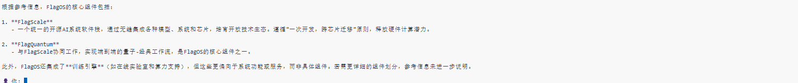

# 推理部署实验手册\-天数V150

# 

# **安装FlagGems和vllm\-plugin\-FL：**

安装FlagOS的组件FlagGems和vllm\-plugin\-FL

```Shell
cd /root
pip install -U scikit-build-core==0.11 pybind11 ninja cmake
git clone https://gitcode.com/flagos-ai/FlagGems.git
cd FlagGems
git checkout 6f2585dc9c48d440d856ad75f4aedee66fac365a
pip3 install --no-build-isolation -e .

cd /root
git clone https://gitcode.com/flagos-ai/vllm-plugin-FL.git
cd vllm-plugin-FL
git checkout f11a0f4707aecae245ec81289329b208ede5b06d
pip3 install --no-build-isolation -e . --no-deps
```

# **启动服务（第一次启动约15mins，第二次\<2mins）**

`bash run_serve.sh`

```Shell
# 下载Qwen3-4B模型（下载需要约5分钟）
# pip install -U modelscope
# modelscope download \
  # --model Qwen/Qwen3-4B \
  # --local_dir /flagos/lab/models/Qwen3-4B
 
# 部署服务
export VLLM_ENGINE_ITERATION_TIMEOUT_S=36000
export VLLM_RPC_TIMEOUT=36000000
vllm serve /flagos/lab/models/Qwen3-4B --served-model-name qwen --enforce-eager --max-model-len 4096 --gpu-memory-utilization 0.48
```

Qwen3\-4B权重需要预先下载到/flagos/lab/models/Qwen3\-4B

参数：

\-\-max\-model\-len 4096：模型支持的最大上下文长度（token 数）
\-\-gpu\-memory\-utilization 0\.48 — vLLM 最多使用 GPU 总显存的 48%

# 调用服务（第一次执行约8分钟开始出结果，第二次执行几秒钟开始出结果）

在终端中创建 `client.py` 文件：

```Plain Text
cat > client.py << 'EOF'
from openai import OpenAI

# Set OpenAI's API key and API base to use vLLM's API server.
openai_api_key = "EMPTY"
openai_api_base = "http://localhost:8000/v1"

client = OpenAI(
    api_key="EMPTY",
    base_url=openai_api_base,
)

response = client.chat.completions.create(
    model="qwen",
    messages=[
        {"role": "user", "content": "Give me a short introduction to large language models."},
    ],
    max_tokens=1024,
    temperature=0.7,
    top_p=0.8,
    presence_penalty=1.5,
    extra_body={
        "top_k": 20,
        "chat_template_kwargs": {"enable_thinking": False},
    },
    stream=True,
)

for chunk in response:
    if chunk.choices and chunk.choices[0].delta.content:
        print(chunk.choices[0].delta.content, end="", flush=True)
EOF
```

执行后，当前目录下就会生成 `client.py` 文件，然后运行：

```Plain Text
python3 client.py
```

结果

```SQL
Large language models (LLMs) are advanced artificial intelligence systems designed to understand and generate human-like text. They are trained on vast amounts of text data from the internet, books, articles, and other sources, allowing them to recognize patterns, context, and meaning in language. LLMs can perform a wide range of tasks, such as answering questions, writing essays, coding, creating stories, and even engaging in conversations. These models are built using deep learning techniques, particularly transformer architectures, which enable them to process and generate text efficiently and effectively. Their ability to handle complex language tasks makes them powerful tools in fields like natural language processing, customer service, education, and more.
```

# 对话聊天

在终端中创建 `chat.py` 文件：

```Python
cat > chat.py << 'EOF'
import openai
from openai import OpenAI
import socket
import sys

# 1. 自动获取网关 IP (解决 Docker 网络问题)
def get_gateway_ip():
    try:
        with open('/proc/net/route', 'r') as f:
            for line in f:
                parts = line.split()
                if parts[1] == '00000000': # 默认路由
                    gateway_hex = parts[2]
                    # 转换十六进制为 IP (注意字节序反转)
                    ip = '.'.join(str(int(gateway_hex[i:i+2], 16)) for i in (6, 4, 2, 0))
                    return ip
    except Exception:
        pass
    return "172.17.0.1" #  fallback

gateway_ip = get_gateway_ip()
# 关键修改：因为我们确认服务就在本容器内，所以直接用 localhost
BASE_URL = f"http://localhost:8000/v1"
MODEL_NAME = "qwen"  # 必须与 vllm serve --served-model-name 一致

print(f"🔗 正在连接:: vLLM 服务端: {BASE_URL}")
print(f"🤖 模型名称: {MODEL_NAME}")
print("=" * 50)

# 2. 初始化客户端 (新版 SDK 写法)
client = OpenAI(
    api_key="EMPTY",
    base_url=BASE_URL,
)

# 3. 初始化对话历史
messages = [
    {"role": "system", "content": "You are a helpful, friendly, and knowledgeable assistant powered by Qwen3-4B."}
]

try:
    # 先测试一下连通性
    client.models.list()
    print("✅ 连接成功！开始聊天 (输入 'quit' 退出)\n")
except Exception as e:
    print(f"❌ 连接失败: {e}")
    print("💡 请检查:")
    print(f"   1. 服务端是否已启动且监听 --host 0.0.0.0")
    print(f"   2. 服务端 IP 是否是 {gateway_ip}")
    sys.exit(1)

# 4. 多轮对话循环
while True:
    try:
        user_input = input("👤 You: ").strip()
        if user_input.lower() in ["quit", "exit", "bye"]:
            print("👋 Goodbye!")
            break
        
        if not user_input:
            continue

        # 添加用户消息
        messages.append({"role": "user", "content": user_input})

        # 调用 API (流式输出，体验更好)
        stream = client.chat.completions.create(
            model=MODEL_NAME,
            messages=messages,
            temperature=0.7,
            top_p=0.8,
            stream=True, # 开启流式
        )

        print("🤖 AI: ", end="", flush=True)
        full_response = ""
        
        for chunk in stream:
            if chunk.choices and chunk.choices[0].delta.content:
                content = chunk.choices[0].delta.content
                print(content, end="", flush=True)
                full_response += content
        
        print("\n") # 换行
        # 将 AI 回复加入历史
        messages.append({"role": "assistant", "content": full_response})

    except KeyboardInterrupt:
        print("\n\n🛑 中断退出")
        break
    except Exception as e:
        print(f"\n❌ 发生错误: {e}")
        print("💡 可能是服务端断开了连接，请检查服务端日志。")
        break
EOF
```

```JSON
python3 chat.py
```

# 可选做: 设置RAG

查询"FlagOS Overview"这种专业知识，回答结果不理想：


配置RAG系统：

在容器内创建一个下载目录：

```Plain Text
mkdir -p /tmp/my_embedding_model
cd /tmp/my_embedding_model
```

使用 `wget` 从国内镜像下载所有必要文件：
复制并执行以下命令块（这些链接指向国内镜像 `hf-mirror.com`）：

```Plain Text
BASE_URL="https://hf-mirror.com/sentence-transformers/all-MiniLM-L6-v2/resolve/main"
echo "🚀 开始下载模型文件..."
*# 下载核心文件*
wget -c "$BASE_URL/modules.json"
wget -c "$BASE_URL/config_sentence_transformers.json"
wget -c "$BASE_URL/config.json"
wget -c "$BASE_URL/tokenizer_config.json"
wget -c "$BASE_URL/special_tokens_map.json"
wget -c "$BASE_URL/vocab.txt"
wget -c "$BASE_URL/tokenizer.json"
*# 下载模型权重文件 (这是最大的文件，可能需要一点时间)*
*# 注意：all-MiniLM-L6-v2 通常使用 pytorch_model.bin 或 model.safetensors*
*# 我们尝试下载 pytorch_model.bin，如果没有再试 safetensors*
if ! wget -c "$BASE_URL/pytorch_model.bin"; then
    echo "未找到 pytorch_model.bin，尝试下载 model.safetensors..."
    wget -c "$BASE_URL/model.safetensors"
fi
*# 下载 1_Pooling 配置 (如果有)*
mkdir -p 1_Pooling
cd 1_Pooling
wget -c "$BASE_URL/1_Pooling/config.json" || echo "无 1_Pooling 配置，跳过"
cd ..
echo "✅ 下载完成！文件列表："
ls -lh
```

添加RAG：

```JSON
git clone https://gitcode.com/flagos-ai/docs
```


安装sentence\_transformers

```Plain Text
pip install sentence_transformers
```

修改chat\.py:

```Python
import os
import sys
from typing import List, Any

try:
    from openai import OpenAI
except ImportError:
    print("❌ 缺少 openai 库，请运行: pip install openai")
    sys.exit(1)

# ==========================================
# 1. 配置区域
# ==========================================

BASE_URL = os.environ.get("VLLM_BASE_URL", "http://127.0.0.1:8000/v1")
MODEL_NAME = os.environ.get("VLLM_MODEL_NAME", "qwen")
DEFAULT_LOCAL_PATH = "/tmp/my_embedding_model"
LOCAL_EMBEDDING_PATH = os.environ.get("LOCAL_EMBEDDING_PATH", DEFAULT_LOCAL_PATH)

# 👇 【重要】请在此处确认你的知识库根目录
# 只要指向最外层包含 docs 的目录即可，程序会自动递归扫描子目录
# 如果你的文件在 /root/docs/docs/docs/...，这里填 "/root/docs" 即可
KNOWLEDGE_BASE_DIR = os.environ.get("KNOWLEDGE_BASE_DIR", "/root/docs")

print(f"🔗 正在连接 vLLM: {BASE_URL}")
print(f"📝 使用模型名称: {MODEL_NAME}")
print(f"📂 知识库根目录: {KNOWLEDGE_BASE_DIR}")

# ==========================================
# 2. 初始化嵌入模型
# ==========================================

print(f"\n📚 正在加载嵌入模型...")
try:
    from sentence_transformers import SentenceTransformer
    
    if LOCAL_EMBEDDING_PATH and os.path.exists(LOCAL_EMBEDDING_PATH):
        files = os.listdir(LOCAL_EMBEDDING_PATH)
        has_weights = any(f.endswith('.bin') or f.endswith('.safetensors') for f in files)
        if not has_weights:
            raise FileNotFoundError("未找到模型权重文件 (.bin 或 .safetensors)")
        print(f"   ✅ 加载本地模型: {LOCAL_EMBEDDING_PATH}")
        embed_model = SentenceTransformer(LOCAL_EMBEDDING_PATH, trust_remote_code=True)
    else:
        print("   ⚠️ 本地模型不存在，尝试在线下载 (all-MiniLM-L6-v2)...")
        os.environ['HF_ENDPOINT'] = 'https://hf-mirror.com'
        embed_model = SentenceTransformer("sentence-transformers/all-MiniLM-L6-v2", trust_remote_code=True)
    print("✅ 嵌入模型就绪!\n")

except Exception as e:
    print(f"\n❌ 嵌入模型加载失败: {e}")
    sys.exit(1)

# ==========================================
# 3. RAG 逻辑 (已优化为递归扫描)
# ==========================================

class SimpleVectorStore:
    def __init__(self, model):
        self.model = model
        self.documents: List[str] = []
        self.vectors: List[Any] = []

    def add_documents(self, docs: List[str]):
        if not docs:
            return
        print(f"   📝 正在编码并索引 {len(docs)} 个文本片段...")
        vectors = self.model.encode(docs, convert_to_numpy=True, show_progress_bar=False)
        self.documents.extend(docs)
        self.vectors.extend(vectors)
        print(f"   ✅ 索引完成。库中总片段数: {len(self.documents)}\n")

    def search(self, query: str, top_k: int = 5) -> List[str]:
        """检索最相关的片段"""
        if not self.documents:
            return []
        
        query_vector = self.model.encode([query], convert_to_numpy=True)[0]
        
        from sklearn.metrics.pairwise import cosine_similarity
        import numpy as np
        
        corpus_vectors = np.array(self.vectors)
        similarities = cosine_similarity([query_vector], corpus_vectors)[0]
        
        top_indices = np.argsort(similarities)[::-1][:top_k]
        
        # 【调试】打印检索到的片段和分数
        print(f"\n   🔍 [检索详情] Top {len(top_indices)} 结果:")
        results = []
        for i, idx in enumerate(top_indices):
            score = similarities[idx]
            doc = self.documents[idx]
            preview = doc[:80].replace('\n', ' ') + "..." if len(doc) > 80 else doc.replace('\n', ' ')
            print(f"      [{i+1}] 分数: {score:.4f} | 内容: {preview}")
            
            # 保留分数大于 0.05 的结果，或者至少保留 top_k 中的前几个
            if score > 0.05: 
                results.append(doc)
        
        return results

vector_store = SimpleVectorStore(embed_model)

def load_knowledge_base():
    """
    递归扫描目录下的所有 .md 和 .txt 文件
    """
    docs = []
    abs_base_dir = os.path.abspath(KNOWLEDGE_BASE_DIR)
    
    if not os.path.exists(abs_base_dir):
        print(f"   ❌ 错误：目录不存在 -> {abs_base_dir}")
        print("   💡 提示：请检查 KNOWLEDGE_BASE_DIR 配置或创建该目录。")
        return docs

    print(f"   📂 开始递归扫描: {abs_base_dir}")
    files_count = 0
    total_chunks = 0
    
    # ✅ 核心修改：使用 os.walk 递归遍历所有子目录
    for root, dirs, files in os.walk(abs_base_dir):
        # 可选：跳过隐藏文件夹
        dirs[:] = [d for d in dirs if not d.startswith('.')]
        
        for filename in files:
            if filename.endswith(".txt") or filename.endswith(".md"):
                filepath = os.path.join(root, filename)
                try:
                    with open(filepath, "r", encoding="utf-8") as f:
                        content = f.read()
                        
                        # 智能切分逻辑
                        paragraphs = content.split('\n\n')
                        chunks = []
                        for p in paragraphs:
                            p = p.strip()
                            if not p:
                                continue
                            # 长段落按句号细分
                            if len(p) > 300:
                                sub_chunks = [s.strip() for s in p.replace('\n', ' ').split('.') if len(s.strip()) > 20]
                                chunks.extend(sub_chunks)
                            else:
                                # 短段落直接作为 chunk
                                clean_p = p.replace('\n', ' ')
                                if len(clean_p) > 10:
                                    chunks.append(clean_p)
                        
                        if chunks:
                            rel_path = os.path.relpath(filepath, abs_base_dir)
                            print(f"      ✅ 读取: {rel_path} (切分为 {len(chunks)} 个片段)")
                            docs.extend(chunks)
                            total_chunks += len(chunks)
                            files_count += 1
                        
                except Exception as e:
                    print(f"   ⚠️ 读取失败 {filepath}: {e}")
    
    if files_count == 0:
        print("   ⚠️ 警告：未在目录及其子目录中找到任何 .txt 或 .md 文件！")
        print("   💡 请确认文件是否存在，以及 KNOWLEDGE_BASE_DIR 路径是否正确。")
    else:
        print(f"   🎉 扫描完成！共找到 {files_count} 个文件，生成 {total_chunks} 个文本片段。\n")
        
    return docs

# 加载知识库
kb_docs = load_knowledge_base()
if kb_docs:
    vector_store.add_documents(kb_docs)
else:
    print("   ⚠️ 知识库为空，RAG 功能将无法提供上下文参考。\n")

# ==========================================
# 4. 对话循环
# ==========================================

client = OpenAI(api_key="EMPTY", base_url=BASE_URL)

print("="*60)
print(f"🤖 RAG 机器人就绪 (模型: {MODEL_NAME})")
print("="*60)
print("输入 'quit' 或 'exit' 退出。\n")

while True:
    try:
        user_input = input("👤 你: ").strip()
        if not user_input:
            continue
        if user_input.lower() in ['quit', 'exit', 'q']:
            break

        # 检索相关上下文
        context_chunks = vector_store.search(user_input, top_k=5)
        
        # 构建 Prompt
        if context_chunks:
            # 取前 3 个最相关的片段放入上下文
            final_context = "\n".join([f"- {chunk}" for chunk in context_chunks[:3]])
            system_prompt = f"""你是一个智能助手。请严格根据以下【参考信息】回答用户问题。
如果参考信息中没有答案，请直接说“根据现有资料无法回答”，不要编造事实。

【参考信息】:
{final_context}
"""
        else:
            system_prompt = "你是一个智能助手。未找到相关参考资料，请根据通用知识回答，但需注意可能缺乏特定文档细节。"

        messages = [
            {"role": "system", "content": system_prompt},
            {"role": "user", "content": user_input}
        ]

        print(f"🤖 AI: ", end="", flush=True)
        
        response = client.chat.completions.create(
            model=MODEL_NAME,
            messages=messages,
            temperature=0.7,
            max_tokens=1024,
            stream=True,
            extra_body={"top_k": 20}
        )
        
        for chunk in response:
            if chunk.choices and chunk.choices[0].delta.content:
                print(chunk.choices[0].delta.content, end="", flush=True)
        print("\n")

    except KeyboardInterrupt:
        print("\n👋 再见！")
        break
    except Exception as e:
        print(f"\n❌ 发生错误: {e}")
```

Agent基于本地RAG知识库的回答：


# 可选做: 设置RAG\+Agentic Search

修改`chat.py`

```Python
import os
import sys
from typing import List, Any, Dict

try:
    from openai import OpenAI
except ImportError:
    print("❌ 缺少 openai 库，请运行: pip install openai")
    sys.exit(1)

# ==========================================
# 1. 配置区域
# ==========================================
BASE_URL = os.environ.get("VLLM_BASE_URL", "http://127.0.0.1:8000/v1")
MODEL_NAME = os.environ.get("VLLM_MODEL_NAME", "qwen")
DEFAULT_LOCAL_PATH = "/tmp/my_embedding_model"
LOCAL_EMBEDDING_PATH = os.environ.get("LOCAL_EMBEDDING_PATH", DEFAULT_LOCAL_PATH)
KNOWLEDGE_BASE_DIR = os.environ.get("KNOWLEDGE_BASE_DIR", "/root/docs")

print(f"🔗 正在连接 vLLM: {BASE_URL}")
print(f"📝 使用模型名称: {MODEL_NAME}")
print(f"📂 知识库根目录: {KNOWLEDGE_BASE_DIR}")

# ==========================================
# 2. 初始化嵌入模型
# ==========================================
print(f"\n📚 正在加载嵌入模型...")
try:
    from sentence_transformers import SentenceTransformer

    if LOCAL_EMBEDDING_PATH and os.path.exists(LOCAL_EMBEDDING_PATH):
        files = os.listdir(LOCAL_EMBEDDING_PATH)
        has_weights = any(f.endswith('.bin') or f.endswith('.safetensors') for f in files)
        if not has_weights:
            raise FileNotFoundError("未找到模型权重文件 (.bin 或 .safetensors)")
        print(f" ✅ 加载本地模型: {LOCAL_EMBEDDING_PATH}")
        embed_model = SentenceTransformer(LOCAL_EMBEDDING_PATH, trust_remote_code=True)
    else:
        print(" ⚠️ 本地模型不存在，尝试在线下载 (all-MiniLM-L6-v2)...")
        os.environ['HF_ENDPOINT'] = 'https://hf-mirror.com'
        embed_model = SentenceTransformer("sentence-transformers/all-MiniLM-L6-v2", trust_remote_code=True)
    print("✅ 嵌入模型就绪!\n")
except Exception as e:
    print(f"\n❌ 嵌入模型加载失败: {e}")
    sys.exit(1)

# ==========================================
# 3. 向量存储模块（复用原有逻辑）
# ==========================================
class SimpleVectorStore:
    def __init__(self, model):
        self.model = model
        self.documents: List[str] = []
        self.vectors: List[Any] = []

    def add_documents(self, docs: List[str]):
        if not docs:
            return
        print(f" 📝 正在编码并索引 {len(docs)} 个文本片段...")
        vectors = self.model.encode(docs, convert_to_numpy=True, show_progress_bar=False)
        self.documents.extend(docs)
        self.vectors.extend(vectors)
        print(f" ✅ 索引完成。库中总片段数: {len(self.documents)}\n")

    def search(self, query: str, top_k: int = 5) -> List[Dict[str, Any]]:
        """检索最相关的片段（返回带分数的字典，方便Agent判断）"""
        if not self.documents:
            return []
        query_vector = self.model.encode([query], convert_to_numpy=True)[0]
        from sklearn.metrics.pairwise import cosine_similarity
        import numpy as np
        corpus_vectors = np.array(self.vectors)
        similarities = cosine_similarity([query_vector], corpus_vectors)[0]
        top_indices = np.argsort(similarities)[::-1][:top_k]
        # 返回带分数的结果，方便Agent分析
        results = []
        for idx in top_indices:
            score = float(similarities[idx])
            doc = self.documents[idx]
            results.append({
                "content": doc,
                "similarity_score": score,
                "preview": doc[:80].replace('\n', ' ') + "..." if len(doc) > 80 else doc.replace('\n', ' ')
            })
        return results

vector_store = SimpleVectorStore(embed_model)

# ==========================================
# 4. 知识库加载（复用原有逻辑）
# ==========================================
def load_knowledge_base():
    docs = []
    abs_base_dir = os.path.abspath(KNOWLEDGE_BASE_DIR)
    if not os.path.exists(abs_base_dir):
        print(f" ❌ 错误：目录不存在 -> {abs_base_dir}")
        print(" 💡 提示：请检查 KNOWLEDGE_BASE_DIR 配置或创建该目录。")
        return docs

    print(f" 📂 开始递归扫描: {abs_base_dir}")
    files_count = 0
    total_chunks = 0
    for root, dirs, files in os.walk(abs_base_dir):
        dirs[:] = [d for d in dirs if not d.startswith('.')]
        for filename in files:
            if filename.endswith(".txt") or filename.endswith(".md"):
                filepath = os.path.join(root, filename)
                try:
                    with open(filepath, "r", encoding="utf-8") as f:
                        content = f.read()
                        paragraphs = content.split('\n\n')
                        chunks = []
                        for p in paragraphs:
                            p = p.strip()
                            if not p:
                                continue
                            if len(p) > 300:
                                sub_chunks = [s.strip() for s in p.replace('\n', ' ').split('.') if len(s.strip()) > 20]
                                chunks.extend(sub_chunks)
                            else:
                                clean_p = p.replace('\n', ' ')
                                if len(clean_p) > 10:
                                    chunks.append(clean_p)
                        if chunks:
                            rel_path = os.path.relpath(filepath, abs_base_dir)
                            print(f" ✅ 读取: {rel_path} (切分为 {len(chunks)} 个片段)")
                            docs.extend(chunks)
                            total_chunks += len(chunks)
                            files_count += 1
                except Exception as e:
                    print(f" ⚠️ 读取失败 {filepath}: {e}")

    if files_count == 0:
        print(" ⚠️ 警告：未在目录及其子目录中找到任何 .txt 或 .md 文件！")
        print(" 💡 请确认文件是否存在，以及 KNOWLEDGE_BASE_DIR 路径是否正确。")
    else:
        print(f" 🎉 扫描完成！共找到 {files_count} 个文件，生成 {total_chunks} 个文本片段。\n")
    return docs

# 加载知识库
kb_docs = load_knowledge_base()
if kb_docs:
    vector_store.add_documents(kb_docs)
else:
    print(" ⚠️ 知识库为空，RAG 功能将无法提供上下文参考。\n")

# ==========================================
# 5. Agentic Search 核心模块（新增）
# ==========================================
client = OpenAI(api_key="EMPTY", base_url=BASE_URL)

class RetrievalAgent:
    """检索智能体：自主分析问题、调整检索策略、多轮检索"""
    def __init__(self, vector_store, llm_client, model_name):
        self.vector_store = vector_store
        self.llm_client = llm_client
        self.model_name = model_name
        self.max_retries = 2  # 最大检索重试次数
        self.min_score_threshold = 0.1 # 最低相似度阈值

    def analyze_question(self, question: str) -> Dict[str, Any]:
        """分析用户问题，输出检索策略"""
        prompt = f"""
你是一个检索策略智能体，请分析用户问题并输出JSON格式的检索策略，字段说明：
1. is_complex: 布尔值，是否是复杂问题（需要拆解/多轮检索）
2. core_keywords: 列表，核心检索关键词（3-5个）
3. rewritten_queries: 列表，改写后的检索问句（2-3个，更精准）
4. top_k: 整数，建议的检索数量（3-8）

用户问题：{question}

要求：你的回复必须是一个且仅是一个合法的 JSON 对象。不要包含任何 Markdown 格式（如 ```json），不要有任何开场白或结束语。直接以 {{ 开头，以 }} 结尾。
"""
        try:
            response = self.llm_client.chat.completions.create(
                model=self.model_name,
                messages=[{"role": "user", "content": prompt}],
                temperature=0.1,
                max_tokens=512
            )
            import json
            import re
            content = response.choices[0].message.content.strip()
            # 使用正则表达式提取第一个 { ... } 代码块
            json_match = re.search(r'\{.*\}', content, re.DOTALL)
            if json_match:
                json_str = json_match.group(0)
                return json.loads(json_str)
            else:
                raise ValueError("未在模型输出中找到有效的 JSON 对象")
        except Exception as e:
            # 解析失败则返回默认策略
            print(f" ⚠️ 问题分析失败，使用默认策略: {e}")
            return {
                "is_complex": False,
                "core_keywords": [question],
                "rewritten_queries": [question],
                "top_k": 5
            }

    def check_retrieval_quality(self, results: List[Dict], question: str) -> Dict[str, Any]:
        """校验检索结果质量，判断是否需要补充检索"""
        results_str = "\n".join([
            f"[{i+1}] 相似度: {r['similarity_score']:.4f} | 内容: {r['preview']}"
            for i, r in enumerate(results)
        ])
        prompt = f"""
你是检索结果校验智能体，请分析以下检索结果是否足够回答用户问题，输出JSON格式结果：
1. is_sufficient: 布尔值，结果是否足够（相似度>0.1且内容相关）
2. need_supplement: 布尔值，是否需要补充检索
3. supplement_query: 字符串，补充检索的问句（若不需要则为空）

用户问题：{question}
检索结果：
{results_str}

要求：你的回复必须是一个且仅是一个合法的 JSON 对象。不要包含任何 Markdown 格式（如 ```json），不要有任何开场白或结束语。直接以 {{ 开头，以 }} 结尾。
"""
        try:
            response = self.llm_client.chat.completions.create(
                model=self.model_name,
                messages=[{"role": "user", "content": prompt}],
                temperature=0.1,
                max_tokens=512
            )
            import json
            import re
            content = response.choices[0].message.content.strip()
            # 使用正则表达式提取第一个 { ... } 代码块
            json_match = re.search(r'\{.*\}', content, re.DOTALL)
            if json_match:
                json_str = json_match.group(0)
                return json.loads(json_str)
            else:
                raise ValueError("未在模型输出中找到有效的 JSON 对象")
        except Exception as e:
            print(f" ⚠️ 结果校验失败: {e}")
            return {
                "is_sufficient": len(results) > 0 and results[0]["similarity_score"] > self.min_score_threshold,
                "need_supplement": False,
                "supplement_query": ""
            }

    def agentic_search(self, question: str) -> List[str]:
        """Agentic Search 主流程：多轮检索+策略调整"""
        print(f"\n🤖 智能体开始分析检索策略...")
        # 第一步：分析问题，确定初始检索策略
        strategy = self.analyze_question(question)
        print(f" 📊 问题分析结果：{'复杂问题' if strategy['is_complex'] else '简单问题'}")
        print(f" 🔑 核心关键词：{strategy['core_keywords']}")

        all_results = []
        retry_count = 0

        # 第二步：初始检索（使用改写后的问句）
        for idx, query in enumerate(strategy["rewritten_queries"]):
            print(f" 🔍 第 {idx+1} 轮检索（问句：{query}）...")
            results = self.vector_store.search(query, top_k=strategy["top_k"])
            all_results.extend(results)
            if len(all_results) >= strategy["top_k"]:
                break

        # 去重并按相似度排序
        unique_results = self._deduplicate_results(all_results)
        unique_results = sorted(unique_results, key=lambda x: x["similarity_score"], reverse=True)

        # 第三步：校验结果，必要时补充检索
        while retry_count < self.max_retries:
            check_result = self.check_retrieval_quality(unique_results, question)
            if check_result["is_sufficient"]:
                break
            if not check_result["need_supplement"]:
                break

            # 补充检索
            retry_count += 1
            supplement_query = check_result["supplement_query"] or question
            print(f" 🔍 补充检索（第 {retry_count} 次）：{supplement_query}")
            supplement_results = self.vector_store.search(supplement_query, top_k=strategy["top_k"])
            all_results.extend(supplement_results)
            # 重新去重排序
            unique_results = self._deduplicate_results(all_results)
            unique_results = sorted(unique_results, key=lambda x: x["similarity_score"], reverse=True)

        # 第四步：过滤低质量结果，输出最终上下文
        final_results = [
            r["content"] for r in unique_results if r["similarity_score"] > self.min_score_threshold
        ]

        # 打印检索详情
        print(f"\n 🔍 [Agentic Search 最终结果] Top {len(final_results)} 相关片段:")
        for i, r in enumerate(unique_results[:5]):
            print(f" [{i+1}] 分数: {r['similarity_score']:.4f} | 内容: {r['preview']}")

        return final_results[:3] # 取前3个最相关的

    def _deduplicate_results(self, results: List[Dict]) -> List[Dict]:
        """去重检索结果（基于内容相似度）"""
        seen = set()
        unique = []
        for r in results:
            # 用内容的哈希值去重（简单版）
            content_hash = hash(r["content"][:100])
            if content_hash not in seen:
                seen.add(content_hash)
                unique.append(r)
        return unique

# 初始化检索智能体
retrieval_agent = RetrievalAgent(vector_store, client, MODEL_NAME)

# ==========================================
# 6. 对话循环（升级为Agentic Search）
# ==========================================
print("="*60)
print(f"🤖 Agentic RAG 机器人就绪 (模型: {MODEL_NAME})")
print("="*60)
print("输入 'quit' 或 'exit' 退出。\n")

while True:
    try:
        user_input = input("👤 你: ").strip()
        if not user_input:
            continue
        if user_input.lower() in ['quit', 'exit', 'q']:
            break

        # 核心升级：使用Agentic Search替代原有单次检索
        context_chunks = retrieval_agent.agentic_search(user_input)

        # 构建 Prompt（逻辑不变）
        if context_chunks:
            final_context = "\n".join([f"- {chunk}" for chunk in context_chunks[:3]])
            system_prompt = f"""你是一个智能助手。请严格根据以下【参考信息】回答用户问题。
如果参考信息中没有答案，请直接说“根据现有资料无法回答”，不要编造事实。

【参考信息】:
{final_context}
"""
        else:
            system_prompt = "你是一个智能助手。未找到相关参考资料，请根据通用知识回答，但需注意可能缺乏特定文档细节。"

        messages = [
            {"role": "system", "content": system_prompt},
            {"role": "user", "content": user_input}
        ]

        print(f"\n🤖 AI: ", end="", flush=True)
        response = client.chat.completions.create(
            model=MODEL_NAME,
            messages=messages,
            temperature=0.7,
            max_tokens=1024,
            stream=True,
            extra_body={"top_k": 20}
        )
        for chunk in response:
            if chunk.choices and chunk.choices[0].delta.content:
                print(chunk.choices[0].delta.content, end="", flush=True)
        print("\n")

    except KeyboardInterrupt:
        print("\n👋 再见！")
        break
    except Exception as e:
        print(f"\n❌ 发生错误: {e}")
```





